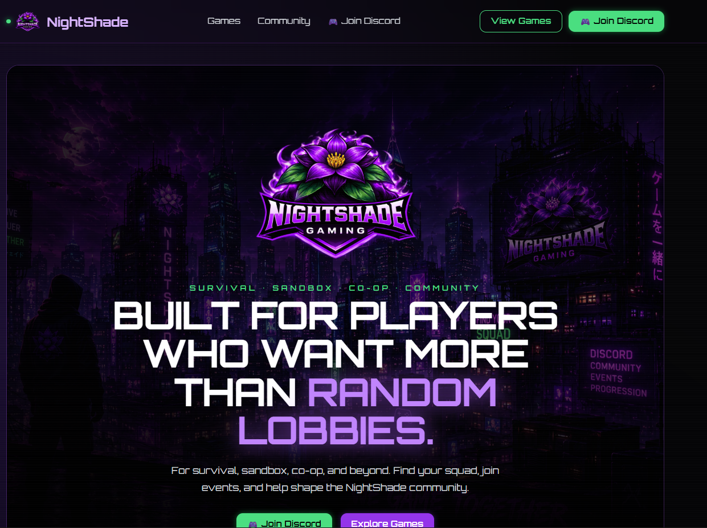
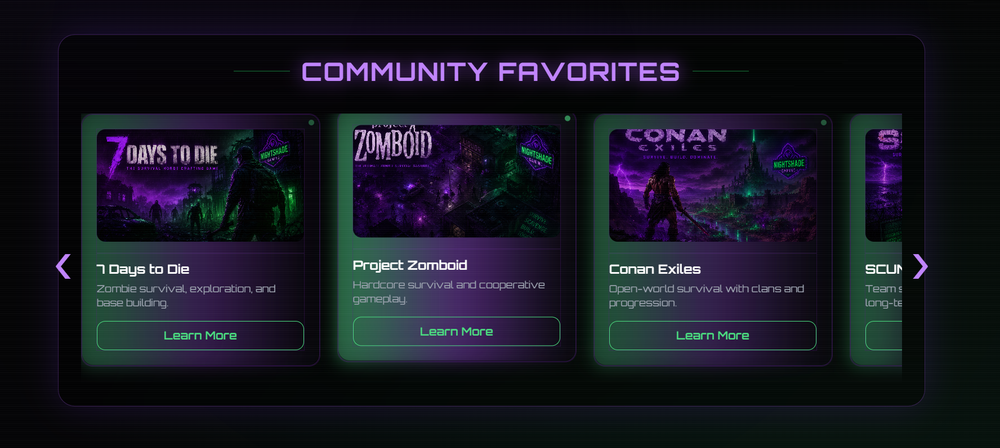

# NightShade Gaming

A modern multi-game community website built for NightShade Gaming.



## Live Website

https://nightshade-gaming.vercel.app/

## About

NightShade Gaming is a multi-game community focused on teamwork, events, progression, and creating a welcoming place for players who want more than random lobbies.

Supported community games currently include:

* 7 Days to Die
* Project Zomboid
* Conan Exiles
* SCUM



## Features

* Responsive modern design
* Mobile-friendly experience
* Community-focused landing page
* Interactive game carousel
* Custom NightShade-themed artwork
* Discord integration
* Automatic deployment through Vercel


## Community

Join the NightShade Gaming Discord:

https://discord.gg/nightshade-servers-561094823231356959

## Road Map

### Completed
✅ Hero redesign
✅ Community carousel
✅ Mobile responsiveness
✅ CTA redesign
✅ Footer redesign
✅ Custom game artwork
✅ GitHub deployment
✅ Vercel deployment

### Planned
🔲 Events section
🔲 Community screenshots
🔲 SEO optimization
🔲 Custom domain
🔲 Discord widget
🔲 News & announcements

### Future
🔲 Dynamic Discord integration
🔲 Community applications
🔲 Event calendar

## Built With

* React
* Vite
* Tailwind CSS
* Framer Motion

## Development

Install dependencies:

```bash
npm install
```

Start development server:

```bash
npm run dev
```

Create production build:

```bash
npm run build
```

## Deployment

This project is automatically deployed through Vercel.

Any changes pushed to the main branch are automatically built and deployed.

---

NightShade Gaming © 2019–2026
